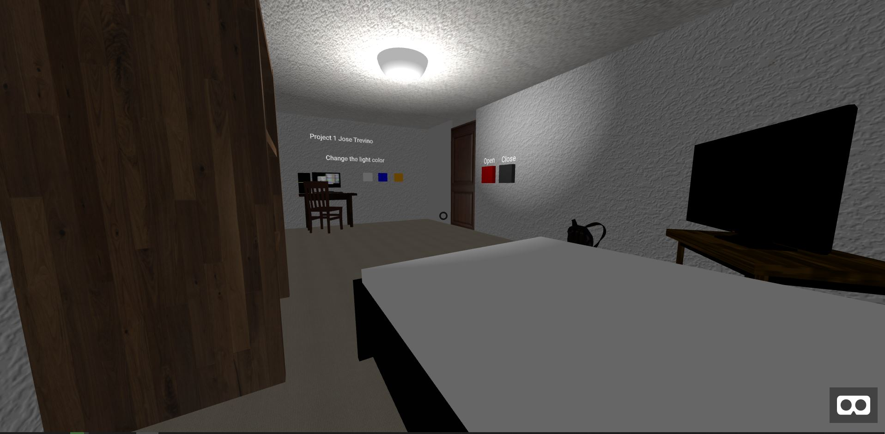
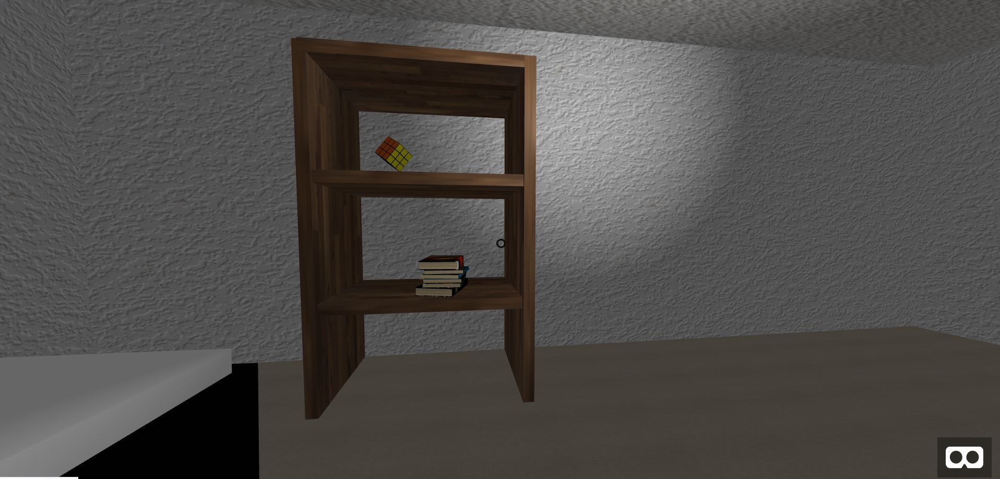
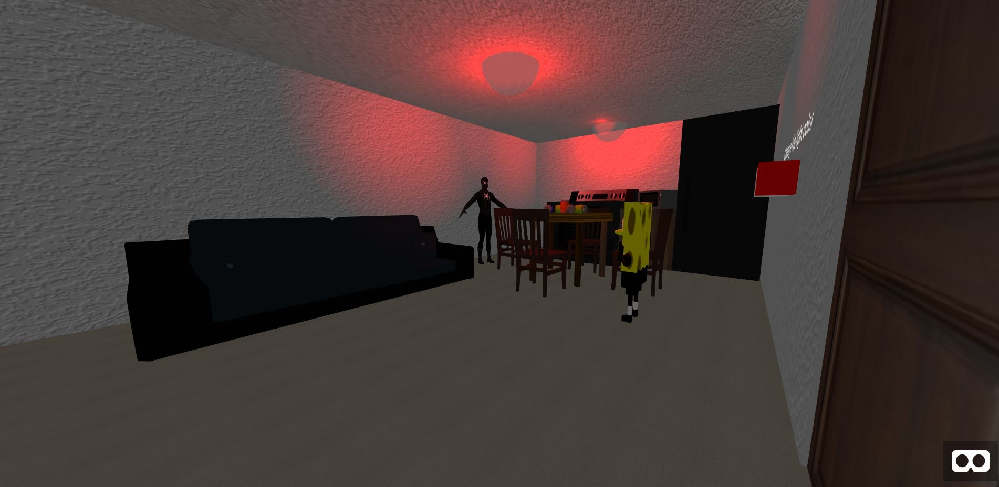
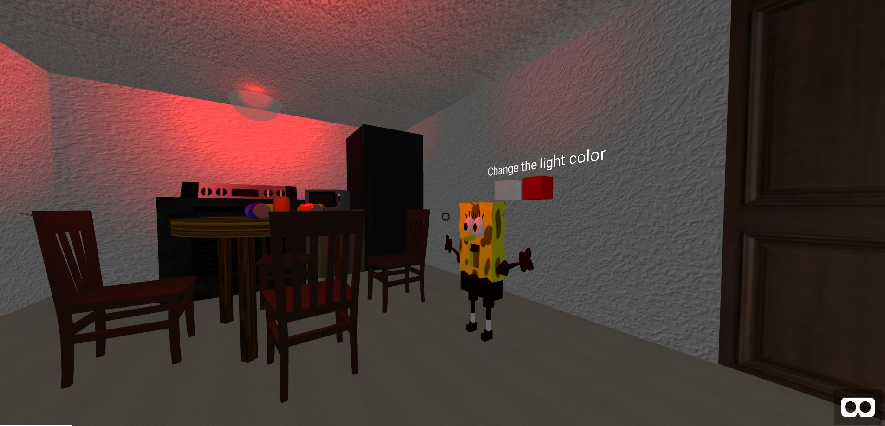
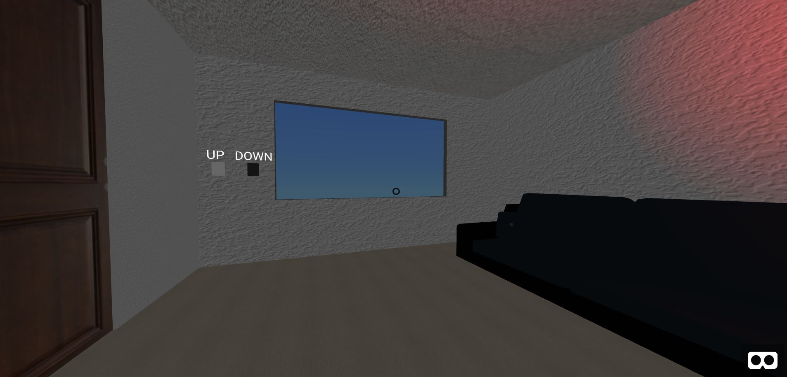

Project 1 Report

[Demo Link](https://bramble-sedate-iberis.glitch.me/)

[Demo Video Link](https://youtu.be/YlUGjJBBVmA)

[Backup Video Link](https://youtu.be/WGv_oe_d4ik)

Bedroom

The bedroom contains the bed, TV, computer, backpack and other models as well as light interactions. The door for the room slides open and close

I included an animated rubik's cube as well on a bookshelve made. 

Kitchen/Living Room

Window with interactable blind

Resources:

Bed - https://poly.google.com/view/dxzCJHu_SC6

Cans - https://sketchfab.com/3d-models/soda-can-props-low-poly-free-44c888130b7d4debbfd9f5db5e3a023f

Spiderman - https://sketchfab.com/3d-models/spiderman-original-2ed06987d6204854a7fe133684cb66e3

Spongebob - https://sketchfab.com/3d-models/sponge-bob-54381dae288f44c1a0ab80dffae3389f
